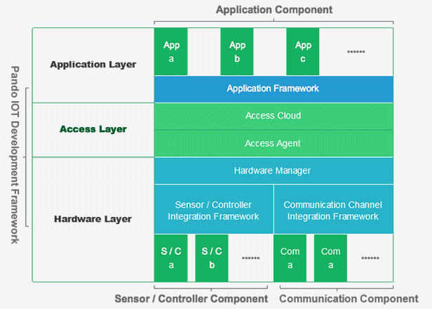

# 2 开发框架  
本章介绍 pando 框架。  

## 2.1 Pando 物联网开发框架介绍  
该章节的更多细节可参考 github上的 [pando-protocol](https://github.com/PandoCloud/pando-protocol) 项目。  

  

Pando 物联网开发框架总体分为应用层、接入层和硬件层。下面对各个层进行分析和讲解：  

- 应用层  
	- 应用组件，比如电脑软件、手机等各种移动应用，比如freeiot的应用，freeiot有开源项目分别基于安卓和iOS，链接地址为： [freeiot](https://github.com/free-iot)；  
	- 应用框架  
	- pando 提供了该应用层的SDK，包括了安卓应用的SDK [pando-android-sdk](https://github.com/PandoCloud/pando-android-sdk) 以及iOS 平台的SDK [pando-ios-sdk](https://github.com/PandoCloud/pando-ios-sdk)  
	
- 接入层  
	- 云端接入层，接入云服务器
	- 联网设备接入层，指接入互联网的的联网设备，包括wifi、2G/3G/4G、蓝牙和其他LAN等  
- 硬件层  
	- 硬件管理器
	- 硬件集成框架，硬件集成框架即固件的框架，分为传感器、控制器集成框架，以及通信集成框架。  
	- 传感器、控制器组件和本地通信组件，这些组件都是在集成框架集成上运行。  

Tisan固件已经集成了联网设备接入层，不用做任何处理，为用户做物联网应用提供了极大的方便。  

  